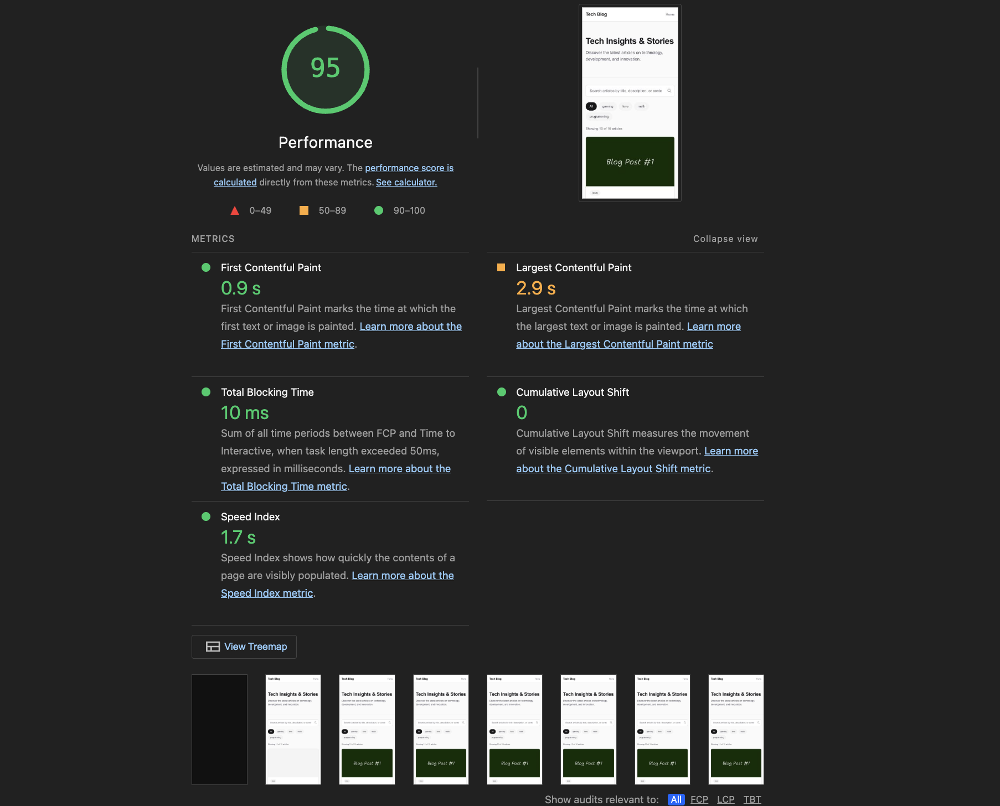
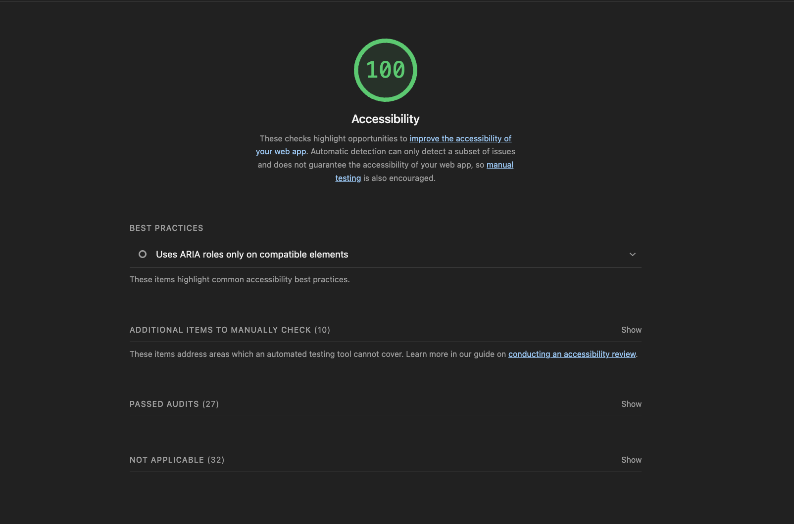
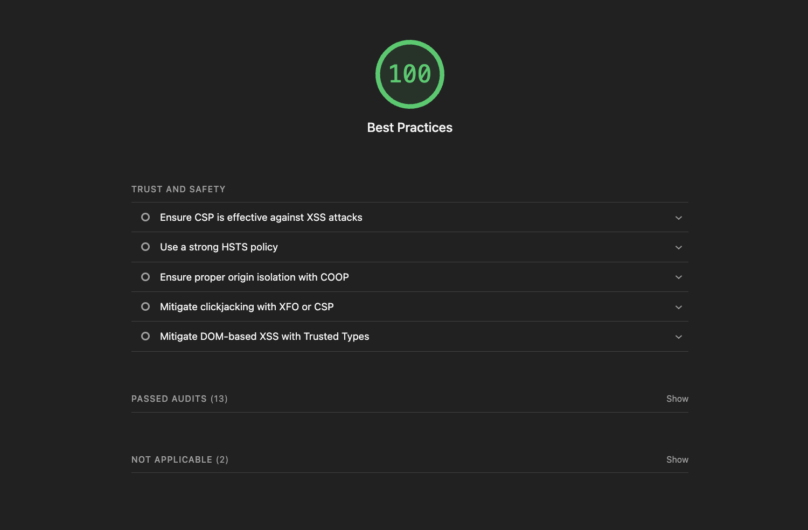
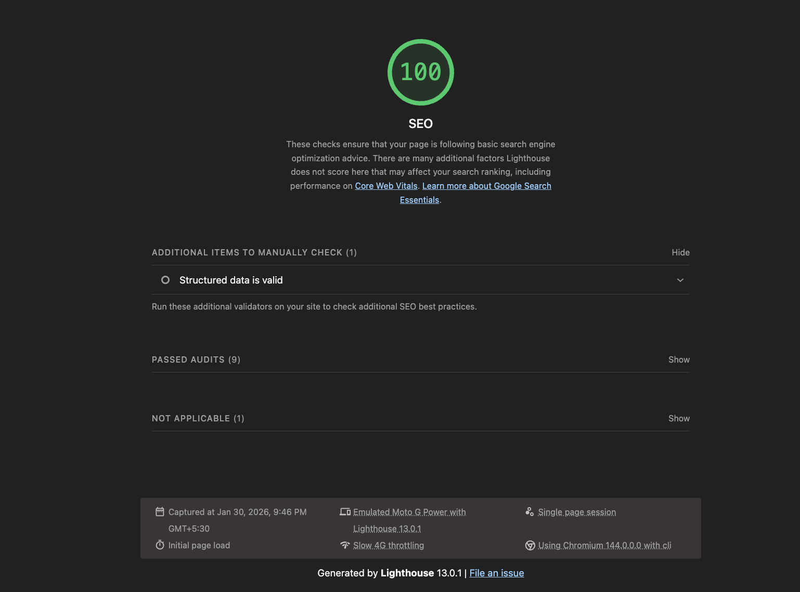

# Tech Blog

A fast, SEO-optimized tech blog built with Next.js, TypeScript, and Tailwind CSS. Displays 10 articles from the [DummyJSON Posts API](https://dummyjson.com/posts) with search, category filtering, and article modals.

## Live Demo

- **Live URL**: [Deploy on Vercel to get your URL]
- **GitHub Repository**: [https://github.com/pallavi300/tech-blog-assignment](https://github.com/pallavi300/tech-blog-assignment)

## Technologies Used

- **Next.js 16** (App Router)
- **TypeScript**
- **Tailwind CSS**
- **Vercel** (deployment)

## Getting Started

### Prerequisites

- Node.js 18+
- npm

### Installation

```bash
npm install
npm run dev
```

Open [http://localhost:3000](http://localhost:3000) in your browser.

### Production Build

```bash
npm run build
npm run start
```

### Environment Variables (Optional)

- `NEXT_PUBLIC_SITE_URL` - Set to your deployment URL (e.g., `https://your-app.vercel.app`) for correct canonical URLs, sitemap, and Open Graph metadata.

### Data Source

- Fetches exactly 10 posts from [DummyJSON Posts API](https://dummyjson.com/posts) (`?limit=10`). Response is mapped to the app’s `BlogPost` shape (category from first tag, placeholder images from Picsum). No pagination per requirements.

## Features

- **Home Page**: Header, Hero section, Article grid (10 posts), Footer
- **Search**: Search across title, description, and content with debouncing
- **Category Filter**: Filter by unique categories from articles; shows active selection
- **Article Modal**: Full article view; close via X button, ESC key, or click outside
- **Responsive Design**: 1 column (mobile), 2 columns (tablet), 3 columns (desktop)
- **Accessibility**: Skip link, keyboard navigation, focus management, ARIA attributes
- **Loading & Error States**: Skeleton/loading UI and graceful API error handling

## Lighthouse Audit Screenshots

**Target scores**: Performance 90+, SEO 95+, Accessibility 85+, Best Practices 90+

### Performance (Target: 90+)



### Accessibility (Target: 85+)



### Best Practices (Target: 90+)



### SEO (Target: 95+)



---

To generate these screenshots: Run `npm run build && npm run start`, then use Chrome DevTools Lighthouse tab or `npx lighthouse http://localhost:3000 --view` to capture each category and save to the `screenshots/` directory.

## SEO Strategy

### Meta Tags

- **Page Title** (≤60 chars): "Tech Blog | Tech Insights & Stories" for clear branding
- **Meta Description** (≤160 chars): Descriptive summary for search snippets
- **Open Graph**: `og:title`, `og:description`, `og:image` for social sharing
- **Twitter Card**: `summary_large_image` with title, description, and image

### Semantic HTML

- `header`, `main`, `article`, `section`, `footer`, `nav`, `time` used throughout
- Single `<h1>` per page (Hero section)
- Proper heading hierarchy (h1 → h2 → h3)

### Image Optimization

- Next.js `Image` component for all images with responsive `sizes`
- Descriptive `alt` text (e.g., "Cover image for: {title}")
- Lazy loading enabled for below-fold images
- Remote images from `picsum.photos` (placeholder per post) configured in `next.config.ts`

### Performance Optimizations

- Client-side fetch via `/api/blog-posts` route (avoids CORS)
- API route fetches from [DummyJSON Posts API](https://dummyjson.com/posts?limit=10) with timeout; maps response to `BlogPost`; on failure returns 502 with clear error; UI shows Retry button
- Debounced search (300ms) to reduce re-renders
- Image lazy loading and skeleton placeholders
- Static generation for metadata, robots.txt, sitemap

## Search and Filter Implementation

- **Search**: Client-side filtering across `title`, `description`, and `content_text` (as required). Case-insensitive match in any of the three fields. Debounced by 300ms.
- **Category Filter**: Unique categories derived from fetched articles (no hardcoded list). "All" plus per-category pills with active state styling.
- **Combined**: Search and category filters apply together. Results count ("Showing X of Y articles") displayed; "No results" message when empty.

## Structured Data (JSON-LD)

- **WebSite schema** on homepage for site-level search visibility
- **Article schema** for each blog post (headline, description, image, dates, author)

## Technical SEO

- `robots.txt`: Allow all crawlers, reference sitemap
- `sitemap.xml`: Homepage URL with lastModified and changeFrequency
- Proper URL structure (clean routes)

## Challenges Faced

- **API Integration**: Handled network errors and invalid responses with try/catch and user-friendly error UI with Retry button
- **API integration**: Using [DummyJSON Posts API](https://dummyjson.com/posts) for blog data. Next.js API route (`/api/blog-posts`) fetches server-side and maps response to app’s `BlogPost` shape; client fetches from same origin to avoid CORS.
- **Modal Focus Trap**: Implemented keyboard focus trapping and return-focus-on-close for accessibility
- **Search Debouncing**: Balanced responsiveness with performance using 300ms debounce

## License

MIT
